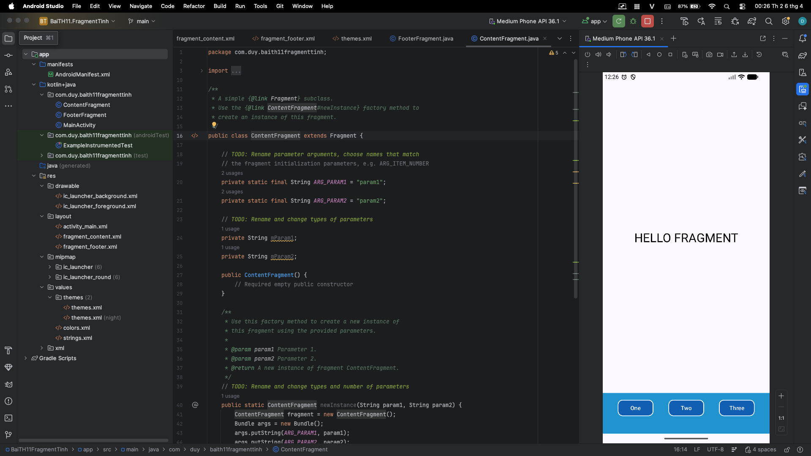
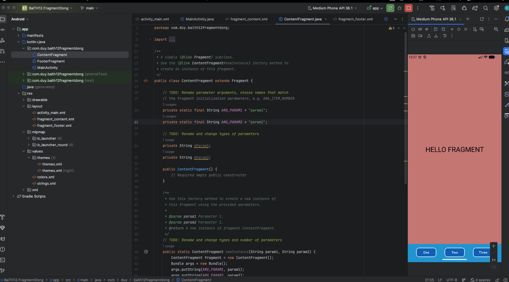
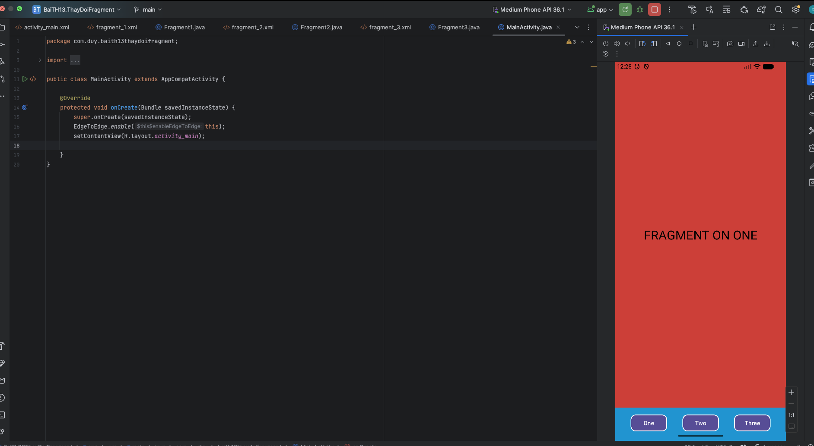
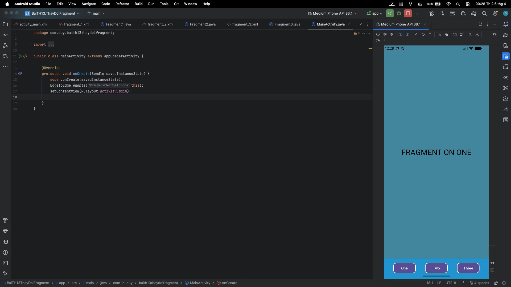
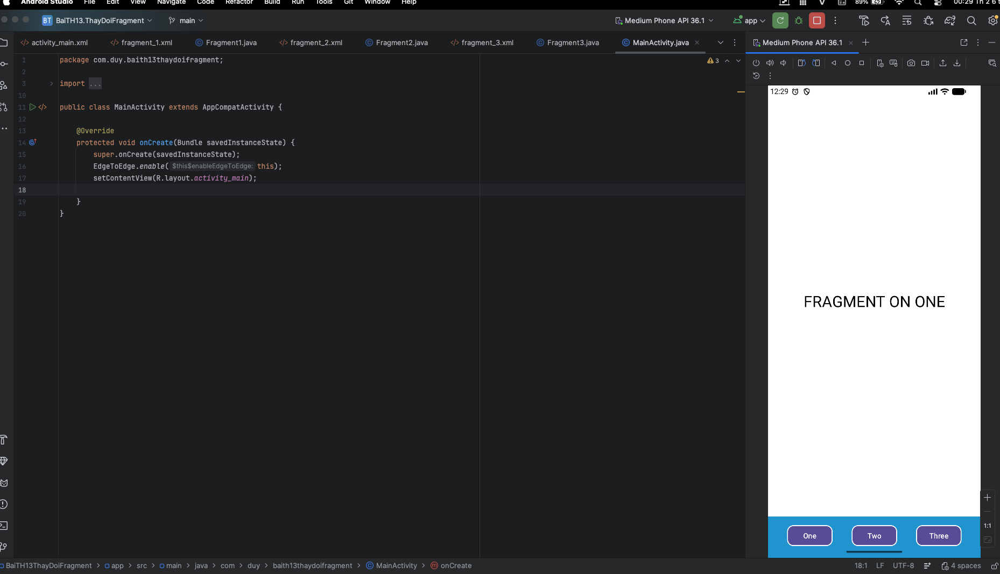
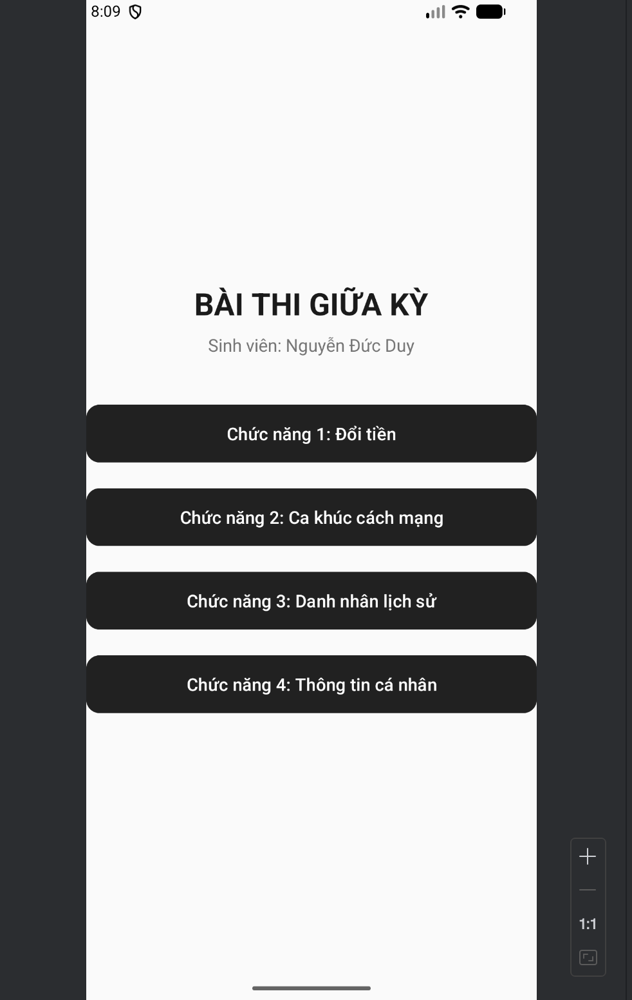
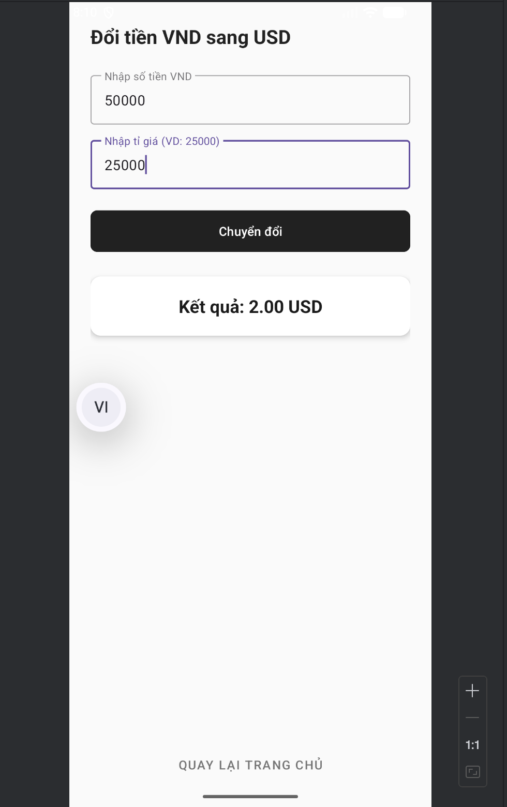
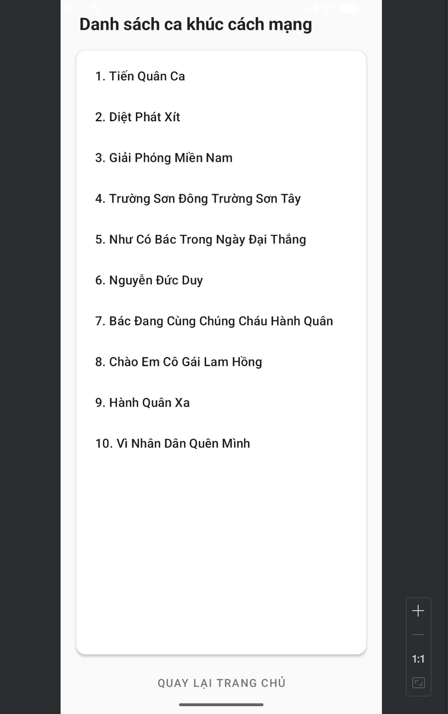
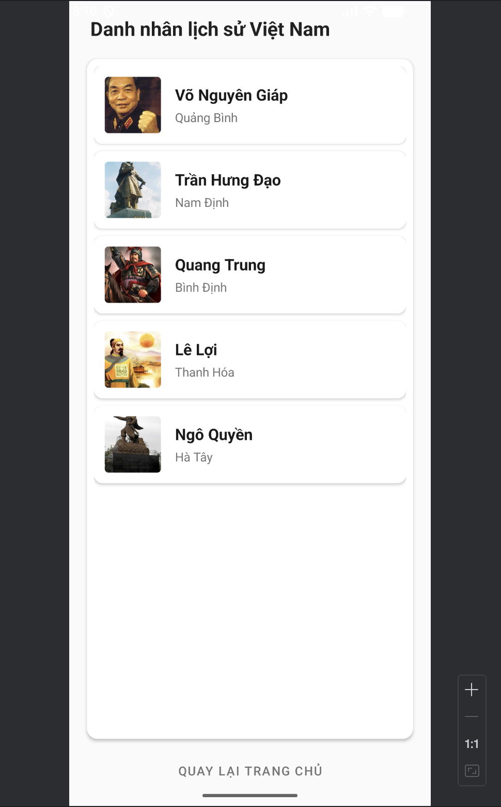
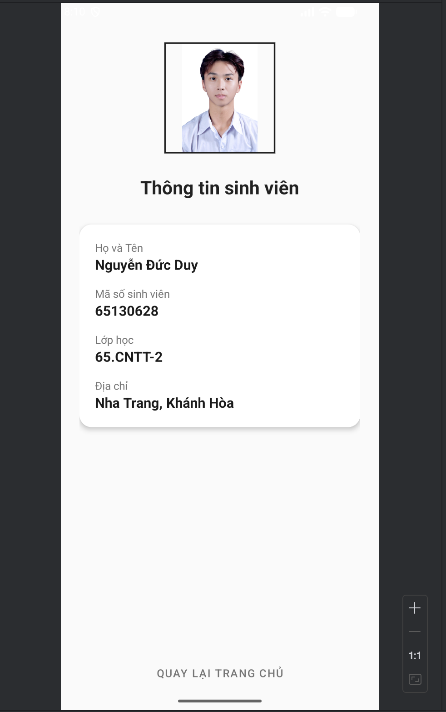

# 65130628_AndroidProgramming
### BÀI THỤC HÀNH 11

  
  
------------------------------------------------------------------------------------

### BÀI THỤC HÀNH 12

  
------------------------------------------------------------------------------------

### BÀI THỤC HÀNH 13
  - Ảnh khi bấm nút ONE
    
    

  - Ảnh khi bấm nút TWO
    
    

  - Ảnh khi bấm nút THREE
    
    

------------------------------------------------------------------------------------
BÀI TẬP LÀM THÊM
  - ảnh khi trang chủ
    
     
  - Ảnh khi click vào thanh menu
    
     
  - Ảnh khi click vào Giới Thiệu
    
     
  - Ảnh khi click vào Menu
    
     
 
------------------------------------------------------------------------------------
### BÀI THI GIỮA KÌ 
[Chi tiết bài tập(https://github.com/NDuy-25/65130628_AndroidProgramming/tree/main/NguyenDucDuy)]
 - Ảnh giao diện trang chủ:

   
 - Ảnh Chức năng 1:

   
 - Ảnh Chức năng 2:

   
 - Ảnh Chức năng 3:

   
 - Ảnh Chức năng 4:

   
  
